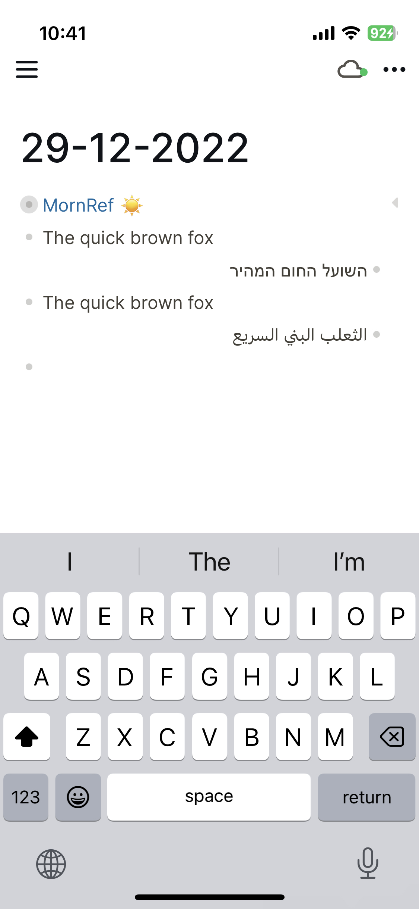
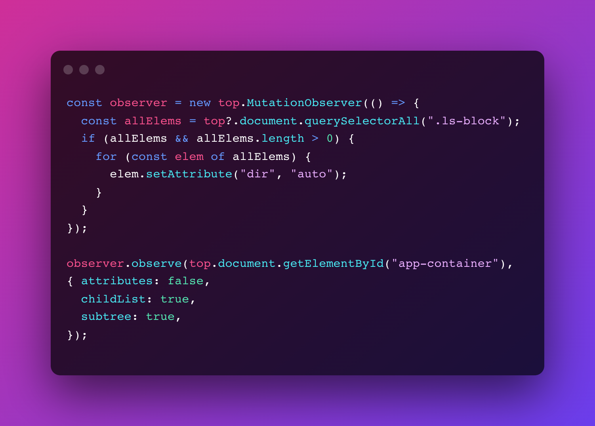

# Overview

This `custom.js` script automatically renders RTL languages right-to-left. Works on mobile as well.

# Instructions

1. Copy and paste the contents of the [`custom.js`](https://github.com/hkgnp/logseq-rtlblocks-plugin/blob/main/custom.js) file into your own `custom.js` file in your `logseq` folder.
2. Restart your desktop app and your RTL languages should be automatically rendered correctly.
3. For mobile, ensure that your `custom.js` file has been synced successfully by checking your mobile's files app.
4. Once sync-ed, restart your Logseq app and RTL languages should be rendered correctly as well.

# Code Snippet

